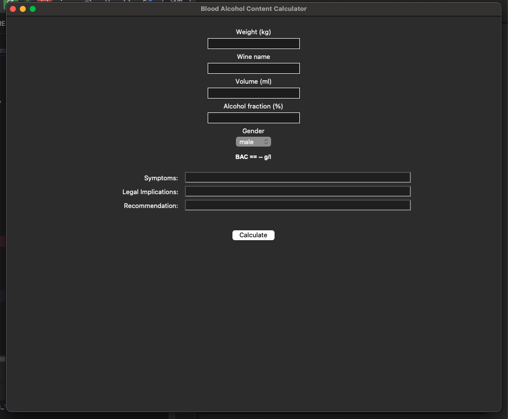
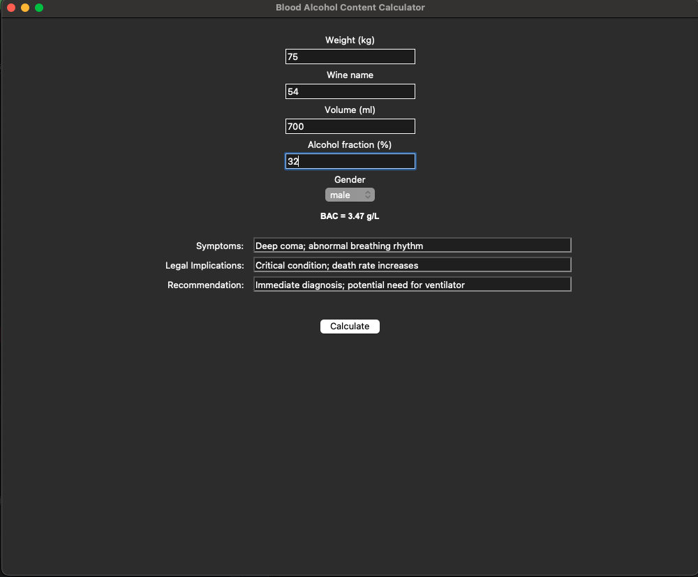

## 为什么写这个程序
仅仅是受到生活中的启发罢了，我朋友因失恋过量饮酒，在喝酒的过程中他貌似不知道酒精对于他自己的影响。 
所以呢，这个程序仅仅是**根据Widnmark公式来计算人体中的血液含量**

## Why did I to write the program 
It is simply inspired by real life .  
My friend drank excessively after a breakup , and during the process, he seemed unaware of how alcohol was affecting him  
So this program is merely **base on the Widmark formula** to calculate the blood alcohol content in the human body 

## For Example
  
